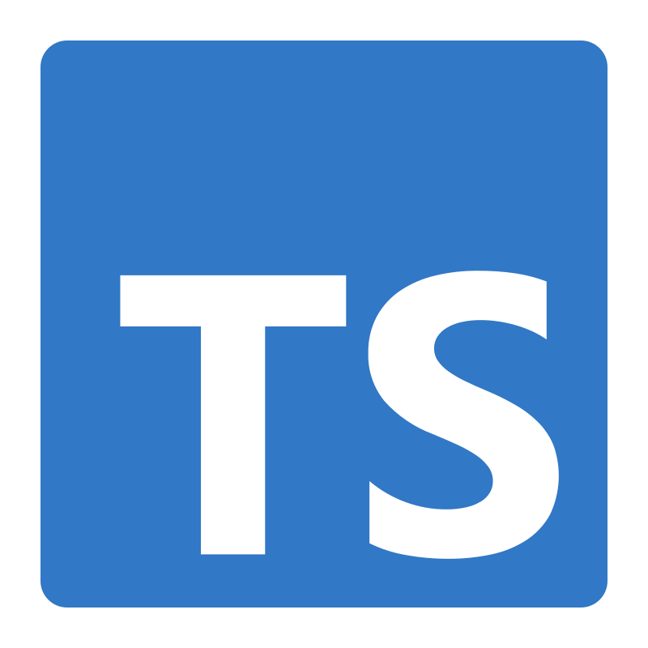
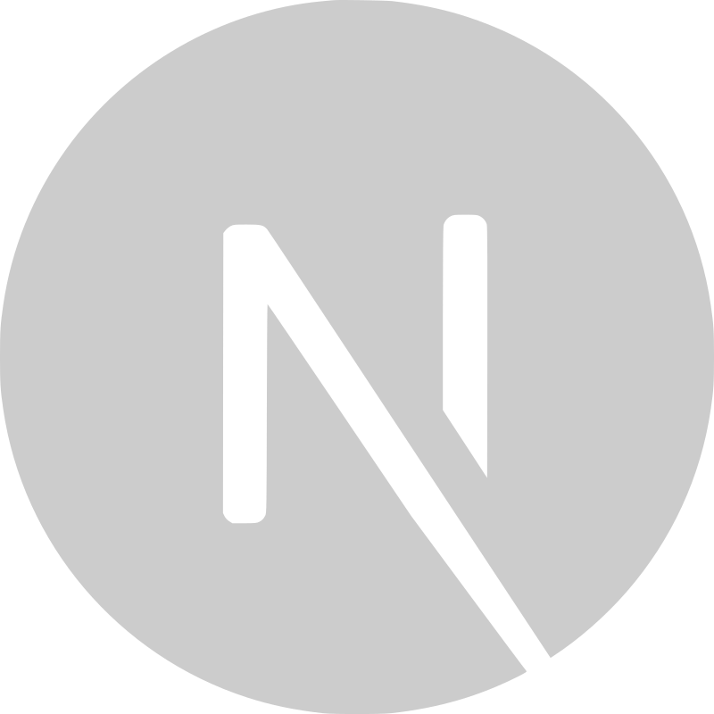
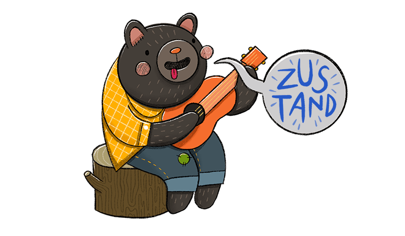

# 👋 Hola, soy Fernando Toledo

### Full-Stack Developer · React · Next.js · TypeScript · Node.js

  <a href="https://toledo.bio">🌐 Portfolio</a>
  &nbsp;&nbsp;•&nbsp;&nbsp;
  <a href="https://www.linkedin.com/in/toledo-fernando-266612245/">💼 LinkedIn</a>
  &nbsp;&nbsp;•&nbsp;&nbsp;
  <a href="mailto:toledof764@gmail.com">📩 Email</a>

---

## 👨🏻‍💻 Sobre mí

Soy **Full-Stack Developer** de Salta, Argentina, con **3 años de experiencia profesional** desarrollando aplicaciones web, mobile y de escritorio.

Mi fuerte está en el **frontend**, principalmente dentro del ecosistema **TypeScript**, trabajando con React, Next.js y React Native. También tengo experiencia desarrollando APIs y servicios backend con Node.js, Express y TypeORM.

Me interesa construir productos que sean **escalables, mantenibles y agradables de usar**, participando tanto en la interfaz como en la lógica de negocio, APIs y bases de datos.

Actualmente estoy **disponible para nuevas oportunidades**.

---

## 🛠️ Stack

### Frontend

  
  
  
  
  
  
  
  
  

`React` · `Next.js` · `React Native` · `TypeScript` · `JavaScript` · `Astro` · `Tailwind CSS` · `NativeWind` · `Zustand` · `Redux` · `GSAP`

### Backend & Data

  
  
  
  

`Node.js` · `Express` · `TypeORM` · `Sequelize` · `PostgreSQL` · `MongoDB` · `Mongoose` · `Bun` · `ElysiaJS`

### Tools & Cloud

`Git` · `Vercel` · `Google Cloud` · `Supabase` · `Expo` · `Electron` · `Wails` · `VS Code`

---

## 💼 Experiencia

### Open Business — Full-Stack Developer

**2023 — 2026 · Remoto**

Desarrollo de funcionalidades para la gestión integral del flujo de pedidos, trabajando principalmente en **backoffice y aplicaciones mobile**, además de participar en el desarrollo backend.

* Desarrollo de interfaces con **React y Next.js**.
* Desarrollo mobile con **React Native y Expo**.
* Desarrollo de APIs y lógica de negocio con **Node.js, Express y TypeORM**.
* Trabajo con **PostgreSQL**.
* Migración de **Expo SDK 50 → 54**.
* Modernización de interfaces utilizando **NativeWind**.
* Mejoras de rendimiento y experiencia de usuario.

**Stack:** React · Next.js · TypeScript · React Native · Expo · NativeWind · Node.js · Express · TypeORM · PostgreSQL

### Marloyal Energy — Full-Stack Developer

**2022 — 2023 · Remoto**

Desarrollo integral de una plataforma web, desde el sitio corporativo hasta la aplicación y backend.

* Landing corporativa desarrollada con **Astro**.
* Aplicación web con **React y Next.js**.
* Autenticación y dashboard.
* Backend y APIs con **Node.js y Express**.
* Persistencia con **MongoDB y Mongoose**.
* Integración de pagos con **Stripe**.
* Implementación de webhooks y flujo post-pago.
* Interfaces con **Material UI** y manejo de estado con **Zustand**.

**Stack:** Astro · React · Next.js · TypeScript · Tailwind CSS · Material UI · Zustand · Node.js · Express · MongoDB · Mongoose · Stripe

---

## 🚀 Proyectos destacados

### 💳 Cuotera

**SaaS multi-tenant para gestión de membresías y cobros recurrentes.**

Aplicación desarrollada para administrar socios, planes y cuotas, con aislamiento de datos mediante **RLS** e integración con **Mercado Pago**.

**Stack:** React · TypeScript · Supabase · PostgreSQL · Edge Functions · Zustand · TanStack Query · React Hook Form · Zod · GSAP

---

### 📱 ADBscope

**Aplicación de escritorio para gestionar dispositivos Android.**

Permite conectarse mediante ADB y consultar información del dispositivo, realizar screen mirroring, visualizar logs y utilizar una terminal ADB.

**Stack:** Go · Wails · React · TypeScript · Tailwind CSS · GSAP

🔗 [Ver proyecto](https://adbscope.online/)

---

### ⚡ NovaLanding

Landing desarrollada para pequeños negocios, enfocada en **presencia online, SEO y rendimiento**.

**Lighthouse:** `98 Performance` · `100 SEO`

**Stack:** Astro · TypeScript · Tailwind CSS · GSAP

🔗 [Visitar sitio](https://novalanding.online/)

---

### ✨ Salón Genesis

Landing desarrollada para un salón de belleza real, enfocada en presentar servicios y facilitar el contacto con el negocio.

**Lighthouse:** `98 Performance` · `100 SEO`

**Stack:** Astro · TypeScript · Tailwind CSS · GSAP

🔗 [Visitar sitio](https://salongenesis.online/)

---

### 🏨 PF — Dinamita Hostel

Proyecto final de **SoyHenry**, desarrollado en equipo junto a otros 7 desarrolladores.

Plataforma de gestión y reserva de hospedajes, participando tanto en frontend como backend.

**Stack:** React · TypeScript · Sass · Redux · Node.js · Express · Sequelize · PostgreSQL

🔗 [Ver repositorio](https://github.com/kripto-c/HostelProject)

---

## 🌎 Actualmente

📍 **Salta, Argentina**

💻 **Full-Stack Developer**

🎯 **Foco:** Frontend & TypeScript

🟢 **Disponible para nuevas oportunidades**

---

## 📬 Contacto

Si querés charlar sobre un proyecto, una oportunidad laboral o simplemente intercambiar una idea, podés encontrarme acá:

  <a href="https://toledo.bio">
    <strong>🌐 toledo.bio</strong>
  </a>
  &nbsp;&nbsp;•&nbsp;&nbsp;
  <a href="https://www.linkedin.com/in/toledo-fernando-266612245/">
    <strong>LinkedIn</strong>
  </a>
  &nbsp;&nbsp;•&nbsp;&nbsp;
  <a href="mailto:toledof764@gmail.com">
    <strong>Email</strong>
  </a>

---

### Gracias por pasar 👋

Construyendo productos, aprendiendo cosas nuevas y tratando de hacer software un poquito mejor cada día.

