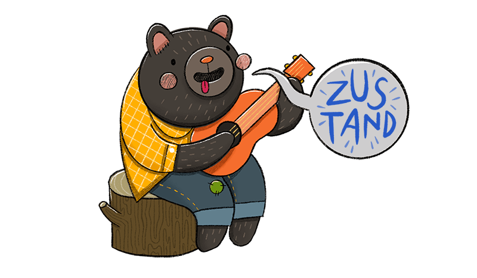

<!--  -->

    <h2 align="center">¡Hola 👋! Soy Toledo Fernando 👨🏻‍💻</h2>

    
Soy <strong>Desarrollador web Full Stack</strong>!   

# **Sobre mi**

 
Desarrollador Full Stack con experiencia en el desarrollo web junto a tecnologias como React, Redux, Sass, Node.js y Express, y tengo conocimientos en bases de datos tanto SQL (PostgreSQL y Sequelize) como noSQL (MongoDB y Mongoose), entre otras. Me considero una persona responsable y apasionada por el aprendizaje continuo. Estoy constantemente buscando oportunidades para mejorar mis habilidades y mantenerme al día con las últimas tendencias en el campo.
  

## **Habilidades en Frontend:**

  
  
  
  
  
  
  
  
  

---

## **Habilidades en Backend:**

  
  
  
  
  
  
  

---

## - Otras Herramientas y Metodologías

  
   
   

# **Algunos Proyectos:**

## ElectronPlayer - App Desktopㅤㅤㅤㅤㅤㅤㅤㅤㅤㅤㅤㅤㅤㅤㅤㅤㅤㅤㅤㅤㅤㅤㅤㅤㅤㅤㅤ

#### Marzo 2022 - Abril 2022

- ElectronJS
- Typescript
- Zustand
- React
- Sass

[Repo](https://github.com/ToledoFernando/newElectronPlayer)

## ElectronPlayer - Web

#### Marzo 2022 - Abril 2022

- NextJS
- React
- TailwindCSS

[Repo](https://github.com/ToledoFernando/electronplayerpage2) - [Web](https://electronplayer.online/)

## Henry (Proyecto Grupal) - Hostel Dinamita ㅤ

#### Noviembre 2022 - Diciembre 2022

- ReactJS
- Redux
- PostgreSQL
- Sequelize
- Express

[Repo](https://github.com/kripto-c/HostelProject)

## Henry - Food App ㅤㅤㅤㅤㅤㅤㅤㅤㅤㅤㅤㅤㅤㅤㅤ

#### Septiembre 2022 - Noviembre 2022

- ReactJS
- Redux
- PostgreSQL
- Sequelize
- Express

[Repo](https://github.com/ToledoFernando/HenryFood)

## Rick y Morty

- ReactJS

[Repo](https://github.com/ToledoFernando/Rick-y-Morty_Prueba)

# Contactame

<a href='https://www.linkedin.com/in/toledo-fernando-266612245/'><a>ㅤㅤㅤㅤㅤㅤㅤㅤㅤㅤㅤㅤㅤ

